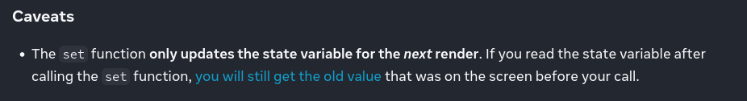
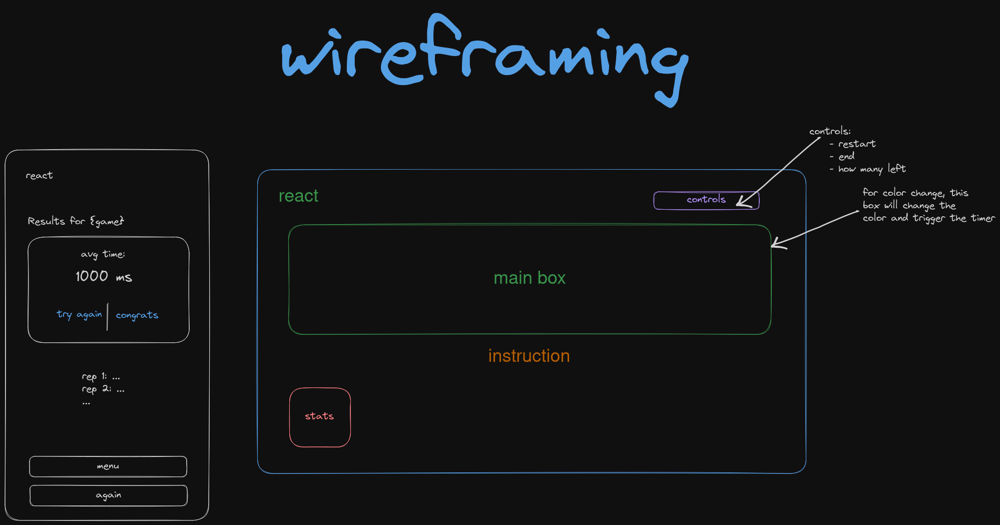
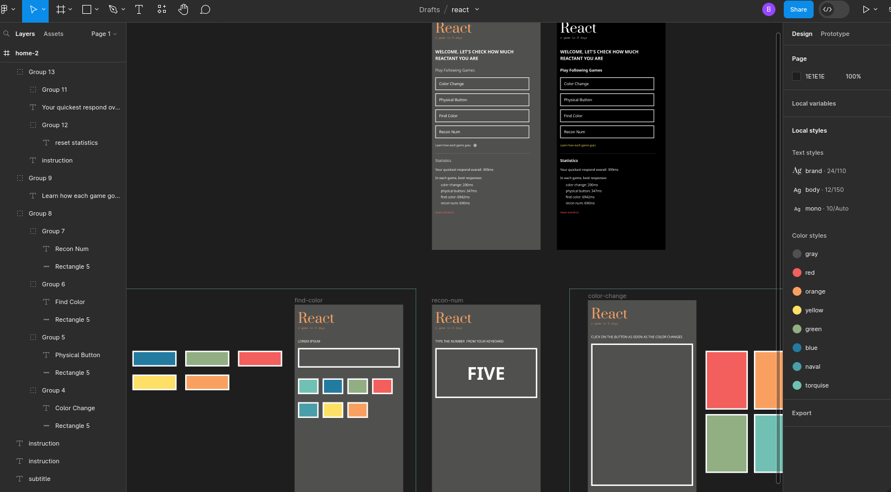

# Can I clone a game in 2 days time? given the community and the opensource

As you can see from the title, this is an experiment. I don't know whether this
would be pulled off or not. I heard about the GrowInCommunity x Showwcase
blogathon on June 28, 2023. So, I wanted to post something also. After some 
thought, I decided to clone a game I stumbled upon. The game is simple but
immersive.

[Final Demo Video](https://youtu.be/Xt-W52iF4o8)

Official Playstore link to the game: 
[Reaction Training](https://play.google.com/store/apps/details?id=com.nixgames.reaction&hl=en&gl=US&pli=1)

*Note*: It is no intend of mine to pirate/clean-room reverse engineer the game.
Just a genuine replica of the game I enjoyed. The canonical product is light-years
better than my rip-off. Give it a try. This is not an affiliation.

## Lessons learned

**Before diving into last 2 days' journey, I would quickly let you in to the 
lessons I learned, for those who just want to get the zest of the project.**

Here are the summaries:

1. place tailwind classes somewhere in the source text, when using dynamic utils 
2. states in react only update in new render 
3. setTimeout takes time in milliseconds. 
4. hooks can only be used inside the function body components
5. in useEffect any state would be captured and might be dirty when run.

Apart from first 2 take-aways, I think rest are infamous for you and assume
you are familiar with them. I will try to explain the first 2 hereafter, giving
my absolute best.

#### tailwindcss' tree-shaking

Tailwindcss manages its behemoth CSS file size from ruining end-user's 
performance is via PostCSS tree-shaking. Tree shaking means, given a CSS file,
a tree-shaking software will determine which styles are used and which are 
redundant then to eliminate the redundant styles from the final output. This 
technique is handled in various stages in Computing, have a look 
[here](https://en.wikipedia.org/wiki/Tree_shaking) for further information on 
general tree-shaking.

**Back to the problem**. So, during development of this project there are many
occasions I want to use the utilities dynamically. But tree-shaked. Thus, I 
have to somehow keep the utilities I needed already hard-coded inside my project.

This also lead to a new paradigm of game-loop. I already had hard-coded styles
to be applied, without the neccessary to build them during runtime, leading to 
a better performance. 

> 2 Birds, 1 Stone.

For an example, in the *Find Color* game, to change the background of the view
box after a *randomly* picked time, I hard-coded the `bg-*` styles into an 
array and indexed them accordingly in the *dispatch* function.

```typescript
// hard-coded to escape the tree-shaking and runtime dependency
const colors = ["bg-red", "bg-orange", "bg-blue", "bg-yellow", "bg-torquise"];

// --snip-- for brevity

// this is how a color is chosen so that they don't repeat sequentially
let targetColor = Math.floor((Math.random() * 100) % 5);
while (color === colors[targetColor]) {
    targetColor = Math.floor((Math.random() * 100) % 5);
}

// this update to the state, renders the viewbox correctly.
setColor(colors[targetColor]);
```

This hadled my tailwindcss problem. If you know a better solution, feel free to 
correct me in the comments or *somehow*. The solution is derived from the 
following [YouTube video](https://youtu.be/aSlK3GhRuXA?t=244)

#### value of states

This was surprisingly new to me. Did you know that **states' values only update 
when there's a new render**? There's a good change, you might not know this; 
because most of the time, states represent some displayed values to the user. 
I am pretty much sure, you couldn't have learned this in MVC-Todo or something.

I stumbled upon this due to the fact I didn't follow good practise. Instead of 
using local variables, I used react's(as in react-framework) states to manage 
the time duration player took to respond. But, never have I ever displayed this 
information in the DOM, just a private to the script. This lead to a peculiar 
behavior.

If I updated the state, it will have older value unless a render is triggered.
Since states had stale values, the functionality was kapudt, it took me a few 
time to realize this; But I guess someone already had this issue, 
[the react doc](https://react.dev/reference/react/useState#setstate)
is very clear and consise, giving the solution. An extract from the above 
mentioned site:-



Further this 
[section](https://react.dev/reference/react/useState#ive-updated-the-state-but-logging-gives-me-the-old-value)
from the official doc delves in deep. From 
[this](https://react.dev/reference/react/useState#ive-updated-the-state-but-logging-gives-me-the-old-value)
 the solution would be to use the second overload of the `useState` function's 
 setter.

 One not so familiar(as far as my knowledge concerns) approah to update 
 the state using the *setter* is by closures. Instead of using the *getter*, we 
 can pass in a closure to the *setter* and have the return value be the new state.
 This way the closure will be provided with correct current state always. I 
 stumbled upon this issue when I had to calculate the time taken to react.

When I started the timer in `useEffect` and then calculated the time duration 
in any dispatch function the `clickTime` state will always have `0` in the next run
or the previous value in the subsequesnt runs. From the video below, this can 
be observed:
 
[Stale State](https://youtu.be/qEebUgm2ByQ)

The problem lies in the line `setResult('... ${clickTime - startTime}')`. Since 
the previous `setClickTime(...)` didn't trigger any UI render, as `clickTime` is 
not used anywhere in the visible DOM, the `clickTime` at the time of execution
following lines hasn't been updated but scheduled to be in next subsequent render.
Thus when the next LOC calculates the value of `clickTime` stays *stale* as `0`;
the result being `-1687...`, since the `startTime` was updated by the `useEffect`
hook.

the solution was to get rid of the `clickTime` state and use short-lived local 
inline calculation. So, I ended up calculating the time duration for reaction 
without storing the `clickTime` as 

```typescript
setResult('...' + (Date.now() - startTime));
```

I still wonder why I didn't do this in the first place. May the reason might be 
due to the fact that I was rushing to finish within the time only focusing on 
the endresult without thinking rationally. This is how bugs get us, devs. Beware!

> Alternatively, you can also use give the *setter* a closure that would return
> the state value that should be updated to.

```typescript
setResult(()=> `... ${Date.now() - startTime}`);

// another example with previous state in account
setTimes(prevTimes => [...prevTimes, Date.now() - startTime]);
```

---

Alright with the zest out of the way, let's get into the app. It should be 
obvious not all the games from the original app can be cloned, because they 
are build with mobiles in mind. I selected a few that is suitable to play with 
keyboard and mouse. 

> **React**, the game is meant to be played on desktops/laptops, only the 
> *color change* level is eaasy on mobiles.

## Forgotten Level: How well are your ears and hands interlinked?

Below are the features I wanted to implement and have succeeded. I also wanted 
to implement a level with hearing measurements. The idea is that after an 
arbitrary milliseconds, app will raise a *sinosoidal* wave via any audio device.
Player should hit either `j` or `f` as soon as the sound stops.

Though it sounds amazing but due to *time* I couldn't find how to do it. I 
however came across this blog post to learn the core, I still couldn't figure 
out a way to trigger `setStartTime` just after the sound ends to measure the time 
to act.

> If you know how to call a function just after speakers stop playing a sound 
> using `AudioContext` and `Web Audio API`, please let me know somehow. A PR to 
> the project would be much appreciatable as well.

The [blog post to refer](https://marcgg.com/blog/2016/11/01/javascript-audio/).

### how to play a sine wave in browser?

To begin with, we should create an `AudioContext` in local scope. Then, we can 
connect sound `generators` to it and have the waves sent to the `destinations`.

```typescript
// the context
let audioCtx = new AudioContext();

// the generator
let osc = audioCtx.createOscillator();

osc.type = "sine" // there are sine, square, triangle ...

// the wave
osc.connect(audioCtx.destination)
osc.start()

setTimeout(()=> {osc.stop()}, 2003);
```
Above javascript code snippet will play a short *sine* wave via connected 
speakers for 2003ms and end(well it should, depending on your browser support 
blurs).

> For further information on 
> [Web Audio API](https://developer.mozilla.org/en-US/docs/Web/API/Web_Audio_API)

## Plan of Attack

I plan not to replicate the entire game as the original is designed mobile in 
mind; Thus, I will try to replicate the levels that can be ported to the desktop
or laptop version. Few of such levels I plan to replicate:

- the color change
- recognize the number
- physical button: color change, but for keyboard
- number in order: type numbers in shown order
- find color

I may/may-not be able to complete the game clone. That's the point. I wanted to 
see can I speed up my dev flow given the community around the web. Well it is 
obvious the community is great, but I might not be able to steer through; the 
aim is to can someone noob(like me) do this?

## Video

I compiled a video for vlog-lovers. Enjoy! Excuse my amatuer editing.

## The Design Phase

First I would just like to create a minimal viable product. So, I went on with 
a pastel palette from Cooolers. For the time being, this is enough, I presume.
The original however is black&white, my last edition would be the same.

### 1. Wireframes

Instead of wireframing every single screen, I only drew few of them. If any 
other shared the layout somehow, I didnt feel like doing them. I took this 
decision as I had to finish the product in 2 days. 

Another point to mintion is that I didn't wireframe at a go, I did it as I 
needed, sort of optimization I equipped; this technique is saw throughout the 
project. Here are the Wireframes collection:



### 2. UI Design

Since this is a clone, UI design needed little care. I just based the clone 
entirely on the UI design of the original product. So, this also saved me time.
However, I did first used a custom palette, and developed an MVP; thenafter
only I gave the finishing touch. The design scrrenshots are attached herewith
and hyper-lapsed video.



# TODO: add the hyper-lapsed video of design

